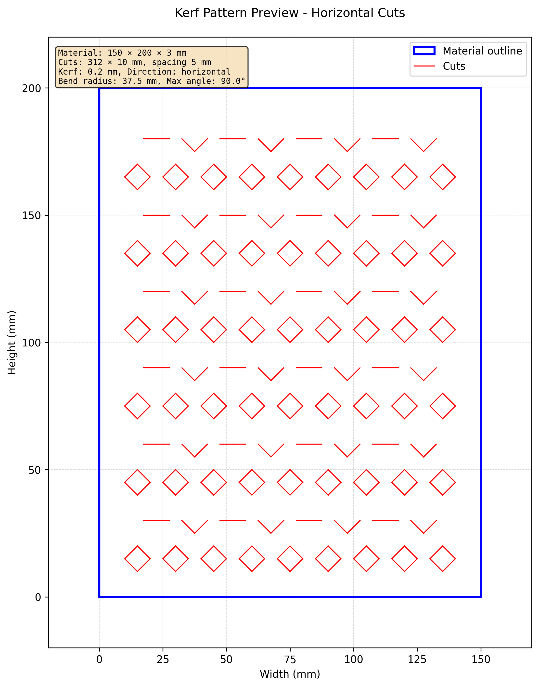
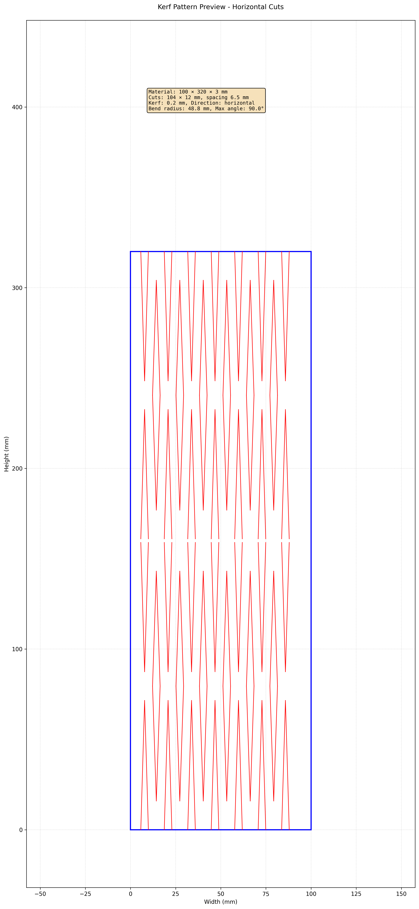
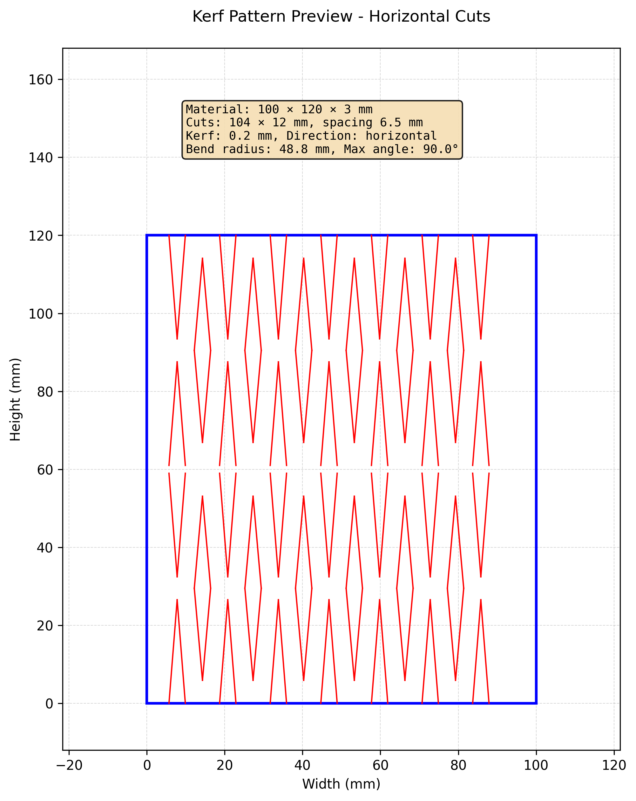

# Living Hinge Generator

Python command line tool and library for generating kerf cutting patterns (living hinges) for laser cutting.

## Overview

Kerf cutting creates flexible joints in rigid materials by making strategic cuts. This library generates these patterns and exports them as DXF files (for Fusion 360, Lightburn) and preview images.

**Living hinges** allow rigid materials like wood or acrylic to bend by removing material in specific patterns. All pattern types in this library create living hinges - the difference is the cut shape used.

## Features

- **Three Pattern Types**: Straight cuts, diamond shapes, and oval shapes
- **Vertical Row Stacking**: Automatic or manual stacking for tall materials
- **DXF Export**: Compatible with Fusion 360 and Lightburn
- **Image Previews**: Visual verification of patterns before cutting
- **Parametric Control**: Adjust spacing, cut length, material dimensions, and more
- **CLI and Python API**: Use from command line or integrate into your workflow

## Usage

### Python API

```python
from kerf_generator import generate_living_hinge, KerfParameters

# Diamond pattern with automatic row stacking
params = KerfParameters(
    material_width=100,         # mm
    material_height=200,        # mm
    material_thickness=3,       # mm
    kerf_width=0.2,            # mm
    cut_spacing=6.5,           # mm
    cut_length=12,             # mm (diamond width)
    cut_offset=8,              # mm
    pattern_type='diamond',     # 'straight', 'diamond', or 'oval'
    num_vertical_rows=None      # None = auto-calculate, or specify 1, 2, 3...
)

# Generate and export
generate_living_hinge(
    params,
    dxf_output="pattern.dxf",
    image_output="pattern.png"
)
```

### Command Line

```bash
# Diamond pattern with auto-stacking
kerf generate -w 100 -h 320 -t 3 -k 0.2 -s 6.5 -l 12 -o 8 \
  -p diamond --dxf output.dxf --png output.png

# Force 2 rows on shorter material
kerf generate -w 100 -h 120 -t 3 -k 0.2 -s 6.5 -l 12 -o 8 \
  -p diamond --num-rows 2 --dxf output.dxf

# Interactive mode
kerf interactive
```

## Pattern Types

### Diamond Pattern (Single Row)
Elongated vertical diamonds alternating with split diamonds. Provides omnidirectional flexibility and better stress distribution than straight cuts.



*100×140mm material with single row of diamond patterns*

## Vertical Row Stacking

For tall materials, patterns can be automatically stacked into multiple horizontal bands for better flexibility control and structural integrity.

### Automatic Stacking
Materials taller than 150mm are automatically divided into multiple rows:



*320mm tall material automatically stacked into 2 rows (~160mm each)*

### Manual Override
You can force row stacking even on shorter materials for tighter hinge zones:



*120mm material with manual override to force 2 rows (~60mm each)*

**Benefits of row stacking:**
- Multiple hinge zones for better bending control
- Improved structural integrity
- Enables compound curves along the vertical axis
- Better stress distribution

## Installation

```bash
# Clone the repository
git clone <repository-url>
cd kerf-burning

# Install dependencies with uv
uv sync
```

## Project Status

✅ **Production Ready** - Core features complete with full pattern generation, row stacking, and export capabilities.

See [ONGOING_TASKS.md](./ONGOING_TASKS.md) for detailed implementation status and feature list.

## Documentation

- [Implementation Plan](./ONGOING_TASKS.md) - Detailed roadmap and tasks
- [Project Context](./CLAUDE.md) - Technical decisions and conventions

## Development

```bash
# Activate virtual environment (if needed)
source .venv/bin/activate

# Run tests
uv run pytest

# Format code
uv run black src/

# Type checking
uv run mypy src/

# Linting
uv run ruff check src/
```

## License

Apache License 2.0 - see [LICENSE](LICENSE) file for details.

## Contributing

Contributions welcome! This project is designed to help makers and laser cutting enthusiasts create better living hinge patterns.

## Author

Christopher Brown
